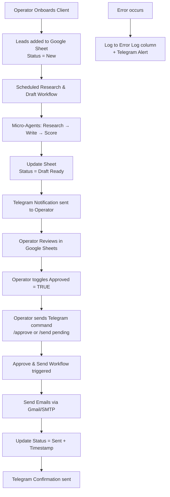
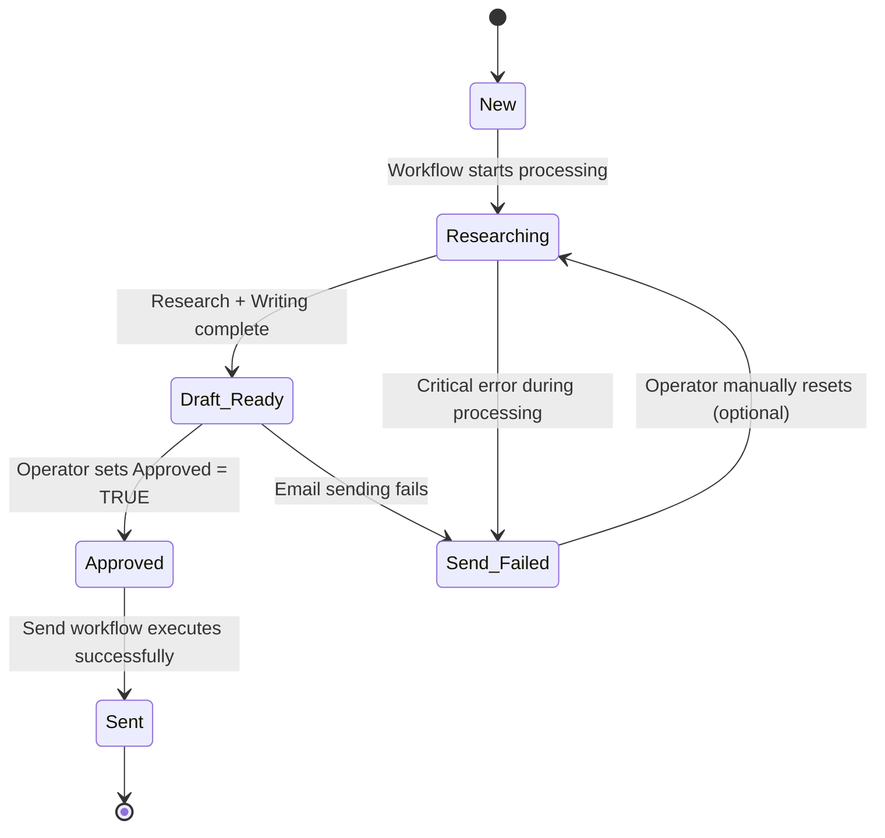

**Application Flow Document**

**Product:** CommissionCrowd Invisible Agent (MVP)  
**Version:** 1.0  
**Date:** May 21, 2026  
**Purpose:** This document describes the complete operational flows of the headless automation system, including automated processes and Operator interactions. It serves as a practical guide for implementation, testing, and daily operation.

---

### 1. Overview

The CommissionCrowd Invisible Agent is a **headless system**. There is no traditional user interface or dashboard. All interaction happens through two primary interfaces:

- **Google Sheets** — Main data layer and approval interface
- **Telegram Bot** — Control panel and notification channel

The system operates through a combination of **scheduled automated workflows** and **Operator-triggered actions**.

---

### 2. High-Level System Flow

---

### 3. Detailed Application Flows

#### Flow 1: Client Onboarding Flow (Operator)

| Step | Action | Interface | Details |
|------|--------|---------|--------|
| 1 | Create client folder in Google Drive | Google Drive | Operator creates folder named after client |
| 2 | Duplicate template sheets | Google Sheets | Duplicate `Leads_Template` and `Config_Template` |
| 3 | Configure client settings | Google Sheets (Config tab) | Fill ICP, tone, sample emails, volume limits |
| 4 | Add initial leads | Google Sheets (Leads tab) | Paste leads with `Status = New` |
| 5 | Store credentials (if needed) | n8n Credential Store | Add Gmail/SMTP credentials for the client |
| 6 | Activate workflow | n8n | Ensure scheduled workflow is active |

**Outcome:** Client is ready for automated processing.

---

#### Flow 2: Research & Draft Generation Flow (Automated)

This is the core automated flow.

**Trigger:** 
- Scheduled (daily at 07:00 SAST by default)
- Or manual trigger via Telegram command `/run research`

**Step-by-Step Flow:**

1. **n8n Schedule Trigger** fires.
2. **Google Sheets Node** reads rows where:
   - `Status = "New"` **AND**
   - `Approved = FALSE` **AND**
   - `Sent Timestamp` is empty
3. **Batch Processing** begins (recommended limit: 20–50 leads per run).
4. For each lead:
   - Update `Status` → `Researching`
   - Call **Researcher Micro-Agent** (Ollama.com Cloud) → Populate `Research Notes`
   - Call **Writer Micro-Agent** → Generate `Email Subject` + `Email Body`
   - Call **Scorer Micro-Agent** (optional) → Assign `Personalization Score`
   - Update `Status` → `Draft Ready`
5. After batch completion:
   - Send **Telegram notification** to Operator with:
     - Summary (e.g., “25 new drafts ready for Client XYZ”)
     - Direct link to the Google Sheet
6. Workflow ends.

**Key Characteristics:**
- Idempotent design (safe to re-run)
- Errors logged per row + Telegram alert for critical failures

---

#### Flow 3: Review & Approval Flow (Operator)

This is the main human-in-the-loop step.

**Step-by-Step Flow:**

1. Operator receives **Telegram notification** that drafts are ready.
2. Operator clicks the Google Sheet link.
3. Operator reviews the following columns for each lead:
   - `Research Notes`
   - `Email Subject`
   - `Email Body`
   - `Personalization Score`
4. Operator makes light edits if needed (optional).
5. Operator toggles the **`Approved`** checkbox column to `TRUE` for leads they want to send.
6. (Optional) Operator can send a Telegram command such as:
   - `/approve ClientName`
   - `/send pending`

**Note:** Sending does **not** happen automatically after checking the box. Approval via checkbox + explicit Telegram trigger is required.

---

#### Flow 4: Approve & Send Flow (Operator Triggered)

**Trigger:** Telegram command from Operator only.

**Step-by-Step Flow:**

1. Operator sends Telegram command (e.g., `/approve HVAC_Pro` or `/send pending`).
2. **Telegram Trigger** node in n8n receives the message.
3. Workflow parses the command and identifies the client/scope.
4. **Google Sheets Node** reads rows that meet **all** conditions:
   - `Approved = TRUE`
   - `Status = "Draft Ready"`
   - `Sent Timestamp` is empty
5. For each qualifying row:
   - Execute **Email Node** (using client’s Gmail or SMTP credentials)
   - Update `Status = "Sent"`
   - Populate `Sent Timestamp`
6. After batch completes:
   - Send **Telegram confirmation** (e.g., “Successfully sent 18 emails for Client XYZ”)
7. Workflow ends.

---

#### Flow 5: Error Handling Flow

1. Any failure in a node (LLM call, Sheets update, email sending) routes to the **Error Handler** branch or sub-workflow.
2. System performs the following:
   - Writes error details to the `Error Log` column of the affected row
   - Updates `Status` to `Send Failed` (if applicable)
   - Sends **Telegram alert** to the Operator with error summary
3. Operator reviews the error in Google Sheets.
4. Operator can manually fix the issue and re-trigger the workflow or specific rows.

---

#### Flow 6: Status Monitoring Flow (Operator)

The Operator can monitor the system through:

| Method              | What it shows                          | How to access                  |
|---------------------|----------------------------------------|--------------------------------|
| Google Sheets       | Full lead status, research, drafts     | Open Leads sheet               |
| Telegram            | Notifications + quick status queries   | Send `/status ClientName`      |
| RunLog tab (optional) | Historical run data                  | View in Google Sheets          |

**Recommended Daily Operator Routine:**
- Morning: Check Telegram for overnight draft notifications
- Review & approve leads in Google Sheets
- Trigger sending via Telegram when ready
- Review any error alerts

---

### 4. Lead Status State Machine

**Valid Status Values:**
- `New`
- `Researching`
- `Draft Ready`
- `Approved`
- `Sent`
- `Send Failed`

---

### 5. Key Interaction Points Summary

| Interaction       | Direction          | Purpose                              | Frequency      |
|-------------------|--------------------|--------------------------------------|----------------|
| Google Sheets     | Read/Write         | Data storage + Approval              | Daily          |
| Telegram          | Notification       | Alerts when drafts are ready         | After each research run |
| Telegram          | Command            | Trigger sending or on-demand runs    | As needed      |
| Ollama.com Cloud  | API Call           | Research + Email generation          | Per lead       |
| Gmail/SMTP        | Send Email         | Final outreach execution             | After approval |

---

### 6. Multi-Client Considerations

- Each client has its own **Config sheet** (tone, ICP, volume limits).
- The `Client Name` column in the Leads sheet determines which configuration to use.
- Workflows are designed to process leads grouped by client.
- Credentials can be stored per client in n8n.

---

### 7. Summary of Main Flows

| Flow Name                    | Type          | Trigger              | Key Interfaces          | Human Touchpoint     |
|-----------------------------|---------------|----------------------|-------------------------|----------------------|
| Client Onboarding           | Manual        | Operator             | Google Sheets           | High                 |
| Research & Draft            | Automated     | Schedule / Telegram  | n8n + Ollama + Sheets   | Low (review only)    |
| Review & Approval           | Manual        | Operator             | Google Sheets           | High                 |
| Approve & Send              | Semi-Automated| Telegram Command     | Telegram + n8n + Email  | Medium               |
| Error Handling              | Automated     | System               | Telegram + Sheets       | Medium               |

---

This **App Flow Document** provides a clear operational map of how the CommissionCrowd Invisible Agent works in practice.

Would you like me to also create:
- A visual flowchart version (Mermaid diagrams expanded)?
- A daily Operator Runbook?
- A version focused on error scenarios and recovery flows?