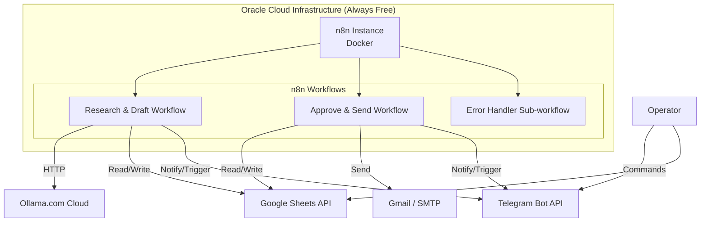

**Backend Structure Document**

**Product:** CommissionCrowd Invisible Agent (MVP)  
**Version:** 1.0  
**Date:** May 21, 2026  
**Purpose:** This document defines the backend architecture, component organization, workflow structure, data flow, and technical implementation details of the headless automation system.

---

### 1. Introduction

The CommissionCrowd Invisible Agent is a **workflow-driven backend system** built primarily on **self-hosted n8n**. There is no traditional backend server (e.g., Node.js, Python, or Go). Instead, the backend logic is implemented as a collection of n8n workflows running on Oracle Cloud Infrastructure.

This document outlines how the backend is structured for maintainability, scalability, and clarity.

---

### 2. High-Level Backend Architecture



**Core Layers:**
- **Orchestration Layer**: n8n (workflow engine)
- **Intelligence Layer**: Ollama.com Cloud (via HTTP)
- **Data & Approval Layer**: Google Sheets
- **Communication Layer**: Telegram Bot
- **Execution Layer**: Email sending (Gmail/SMTP)

---

### 3. Core Backend Components

| Component                  | Technology                  | Responsibility                              | Location          |
|---------------------------|-----------------------------|---------------------------------------------|-------------------|
| Workflow Engine           | n8n (Docker)                | Orchestrates all automation logic           | OCI               |
| LLM Inference             | Ollama.com Cloud            | Research, writing, and scoring              | External          |
| Data Storage & UI         | Google Sheets               | Lead data, configuration, approval flags    | Google Cloud      |
| Control & Notifications   | Telegram Bot                | Operator commands and alerts                | External          |
| Email Delivery            | Gmail API / SMTP            | Final email sending                         | External          |
| Credential Management     | n8n Credential Store        | Secure storage of API keys and tokens       | n8n (OCI)         |
| Error Handling            | n8n Error Workflows         | Logging and alerting                        | n8n (OCI)         |

---

### 4. Workflow Structure (Recommended Organization)

Because n8n is the core of the backend, workflows should be organized clearly:

#### Recommended Workflow Naming Convention

| Workflow Name                        | Type            | Trigger                    | Purpose                                      | Notes |
|--------------------------------------|-----------------|----------------------------|----------------------------------------------|-------|
| `CC_Research_Draft_Main`             | Main            | Schedule + Manual          | Main research and draft generation           | Primary workflow |
| `CC_Approve_Send_Main`               | Main            | Telegram Trigger           | Handles approval and email sending           | Triggered by Operator |
| `CC_Error_Handler`                   | Sub-workflow    | Called from other workflows| Centralized error logging and alerting       | Reusable |
| `CC_Telegram_Command_Router`         | Helper          | Telegram Trigger           | Parses commands and routes to correct workflow | Optional but recommended |
| `CC_Lead_Status_Updater`             | Helper          | Called internally          | Updates status in Google Sheets              | Reusable node/logic |

#### Best Practices for Workflow Structure
- Use **Sub-workflows** for reusable logic (error handling, status updates, Telegram notifications).
- Keep the main workflows focused and readable.
- Use **Switch** or **IF** nodes heavily for status-based routing.
- Store complex LLM prompts in **Set** or **Code** nodes for easy maintenance.

---

### 5. Data Flow Architecture

**Primary Data Flow:**

1. **Input**: Leads entered into Google Sheets (`Status = New`)
2. **Processing**:
   - n8n reads data from Google Sheets
   - Calls Ollama.com Cloud for micro-agents
   - Writes results back to Google Sheets
3. **Control**:
   - Operator updates `Approved` column in Sheets
   - Operator triggers action via Telegram
4. **Output**:
   - Emails sent via Gmail/SMTP
   - Status and timestamps updated in Google Sheets
   - Notifications sent via Telegram

**Data Store Strategy:**
- **Google Sheets** acts as the single source of truth for leads and configuration.
- n8n does **not** maintain its own persistent database in the MVP.
- Execution history is kept in n8n’s built-in database (for debugging).

---

### 6. Backend Folder / Project Structure (Recommended)

Although n8n stores workflows internally, the following structure is recommended for documentation and backup:

```
/CommissionCrowd_Invisible_Agent/
├── workflows/
│   ├── CC_Research_Draft_Main.json
│   ├── CC_Approve_Send_Main.json
│   ├── CC_Error_Handler.json
│   └── CC_Telegram_Command_Router.json
├── prompts/
│   ├── researcher_agent.md
│   ├── writer_agent.md
│   └── scorer_agent.md
├── templates/
│   ├── Leads_Sheet_Template.xlsx
│   └── Config_Sheet_Template.xlsx
├── docs/
│   ├── PRD.md
│   ├── SRS.md
│   ├── App_Flow.md
│   └── Backend_Structure.md
├── credentials/
│   └── (Reference only - never commit real credentials)
└── README.md
```

> **Note:** Workflow JSON files should be exported regularly from n8n for version control and backup.

---

### 7. Integration Architecture

| Integration          | Type          | Authentication          | Direction     | Notes |
|----------------------|---------------|-------------------------|---------------|-------|
| Google Sheets        | REST API      | OAuth2 / Service Account| Bidirectional | Primary data store |
| Telegram Bot         | Webhook / Polling | Bot Token            | Bidirectional | Control + Notifications |
| Ollama.com Cloud     | HTTP          | API Key / Token         | Outbound      | LLM calls |
| Gmail                | OAuth2        | Google OAuth            | Outbound      | Email sending |
| SMTP (Alternative)   | TCP           | Username + Password     | Outbound      | Fallback for email |

---

### 8. Credential & Secret Management

- All credentials are stored in **n8n’s built-in Credential Store**.
- Recommended credentials to create:
  - `Google Sheets OAuth2`
  - `Telegram Bot API`
  - `Ollama.com Cloud API`
  - `Gmail OAuth2` (per client or shared)
  - `SMTP` (if used)
- Never hardcode credentials in workflows.
- Use **Environment Variables** in n8n for non-sensitive configuration where possible.

---

### 9. Deployment Structure on OCI

**Recommended Setup:**

- **Compute**: Oracle Cloud Always Free Ampere A1 instance (4 OCPU / 24GB RAM)
- **Containerization**: Docker + Docker Compose
- **n8n Installation**: Latest stable version via official Docker image
- **Persistence**:
  - n8n data volume mounted for workflow storage
  - Use OCI Block Volume if needed for larger storage
- **Networking**:
  - Public IP with security list allowing necessary ports
  - (Optional) Reverse proxy with Nginx + SSL for production feel

**Startup Stack Example:**
```yaml
services:
  n8n:
    image: n8nio/n8n:latest
    ports:
      - "5678:5678"
    volumes:
      - n8n_data:/home/node/.n8n
    environment:
      - N8N_BASIC_AUTH_ACTIVE=true
      - N8N_BASIC_AUTH_USER=admin
```

---

### 10. Modularity & Scalability Notes

| Aspect                    | Current Approach (MVP)              | Future Improvement                     |
|---------------------------|-------------------------------------|----------------------------------------|
| Workflow Organization     | Multiple focused workflows          | Use more sub-workflows                 |
| Client Isolation          | Via `Client Name` + Config sheet    | Separate workflows per client (optional) |
| Data Storage              | Google Sheets                       | Migrate to Supabase / Postgres later   |
| LLM Calls                 | Direct HTTP to Ollama.com Cloud     | Add caching or fallback models         |
| Error Handling            | Basic per-row logging               | Centralized logging + monitoring       |
| Scaling                   | Vertical (larger OCI instance)      | Multiple n8n instances + queue         |

---

### 11. Summary of Backend Principles

- **Headless by Design**: No frontend layer.
- **Workflow-Centric**: All business logic lives in n8n workflows.
- **External Intelligence**: LLM processing is offloaded to Ollama.com Cloud.
- **Lightweight Data Layer**: Google Sheets used as both database and UI.
- **Operator-Centric Control**: Telegram serves as the lightweight control plane.
- **Modular & Maintainable**: Use sub-workflows and clear naming conventions.
- **Secure by Default**: Credentials managed centrally in n8n.

---

This **Backend Structure Document** provides a clear technical blueprint for how the backend of the CommissionCrowd Invisible Agent is organized and should be implemented.

Would you like me to also create:
- A detailed **n8n Workflow Node Map** for the main workflows?
- A **Docker Compose + OCI Setup Guide**?
- A **Version Control & Backup Strategy** document?