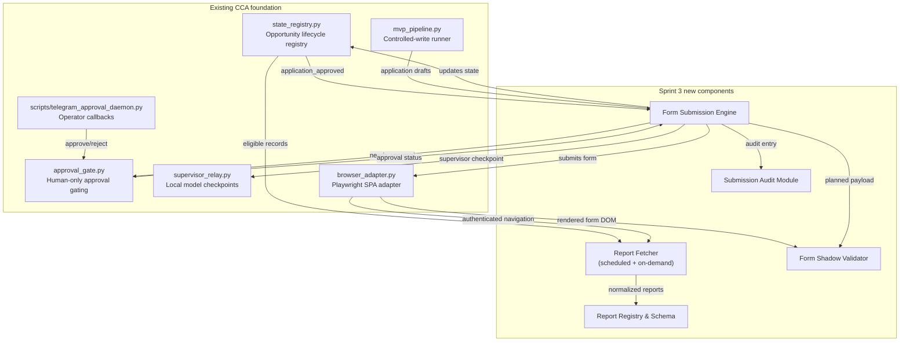
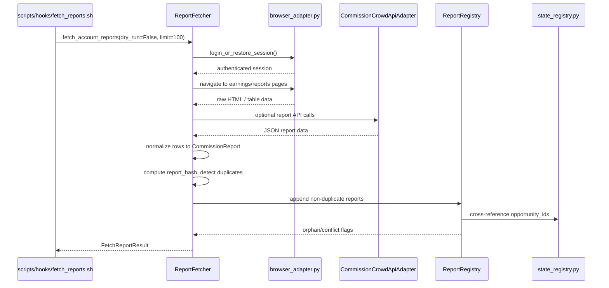
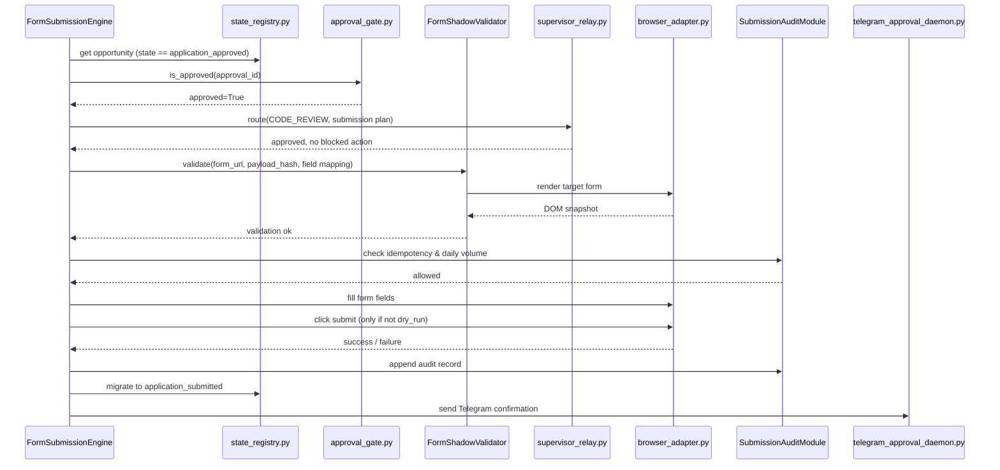
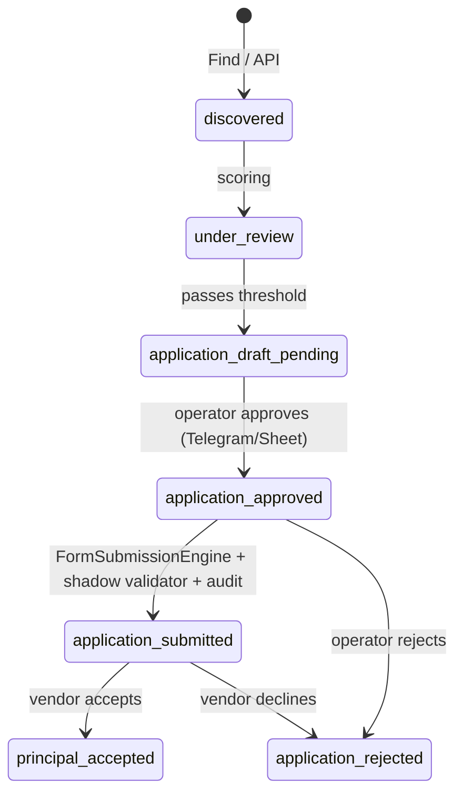

# Sprint 3 Specifications

**CommissionCrowd Invisible Agent — Automated Reporting & Secure Form Submission**

**Version:** 1.0  
**Date:** 2026-06-27  
**Status:** Draft — pending review before implementation  
**Scope:** Two focus areas only
1. Automated commission report fetching mechanisms.
2. Secure agentic form-submission modules.

**Existing foundation:** `state_registry.py`, `approval_gate.py`, `supervisor_relay.py`, `browser_adapter.py`, `scripts/telegram_approval_daemon.py`, `mvp_pipeline.py`.

---

## 1. Goals and Non-Goals

### Goals

| Goal | Why it matters |
|------|----------------|
| Fetch commission and performance reports automatically from CommissionCrowd account pages and API. | Eliminates manual login-and-download cycles; gives the operator a consolidated earnings view. |
| Store fetched reports with full provenance, lineage hash, and deduplication. | Creates an auditable source of truth for payouts, clawbacks, and tax reporting. |
| Submit approved application forms on CommissionCrowd without operator re-keying. | Closes the `application_approved` → `application_submitted` gap safely. |
| Validate every form payload against a Playwright-rendered shadow of the target page before the final click. | Prevents silent data loss from UI drift or field mismatches. |
| Record every submission attempt (success, failure, dry-run) in an immutable audit module. | Supports dispute resolution, compliance, and model fine-tuning. |
| Enforce human-in-the-loop approval, supervisor checkpoints, payload hashing, daily volume limits, and idempotency. | Keeps the agent inside the existing safety perimeter defined by `approval_gate.py` and `supervisor_relay.py`. |

### Non-Goals

| Non-Goal | Rationale |
|----------|-----------|
| General-purpose web scraping outside CommissionCrowd. | Scope is intentionally narrow; generic scraping belongs to a separate workstream. |
| Automated payment withdrawal or banking actions. | Money movement is a `spend` action; permanently blocked by `SupervisorBlockedActionError`. |
| Unsolicited outreach to principals outside the approved application draft. | Outreach send is gated by `ApprovalAction.OUTREACH_SEND` and blocked unless explicitly approved. |
| Replacing the existing CRM/Sheets schema. | New report tables extend, not replace, the current approvals/leads schema. |
| Real-time streaming dashboards. | Reports are batch-fetched; dashboards can consume the persisted report registry later. |

---

## 2. Scope

This specification covers **only** the two areas below. All other workstreams (scoring, deeper research, buyer outreach, ICP campaigns) are out of scope for Sprint 3.

### 2.1 Focus Area A — Automated Commission Report Fetching

Build a `ReportFetcher` that:

- Authenticates via `browser_adapter.py` or the existing REST adapter.
- Navigates to CommissionCrowd earnings/commission pages and extracts structured report data.
- Calls any available CommissionCrowd report API endpoints idempotently.
- Normalizes report rows into a canonical `CommissionReport` model.
- Stores results in a dedicated `report_registry` with lineage hashes.
- Deduplicates by `(opportunity_id, report_type, period_start, period_end, report_hash)`.
- Exposes a read-only interface to downstream analytics and operator tooling.

### 2.2 Focus Area B — Secure Agentic Form-Submission Modules

Build a `FormSubmissionEngine` that:

- Consumes opportunities in state `application_approved`.
- Generates a truthful, already-approved application payload from `mvp_pipeline.py` drafts.
- Runs a Playwright shadow-validator against the live CommissionCrowd application form.
- Halts if field mapping, selectors, or payload integrity checks fail.
- Submits the form only after explicit operator approval and a supervisor checkpoint.
- Updates the lifecycle state to `application_submitted` via `state_registry.py`.
- Writes an immutable audit record to the `submission_audit` registry.

---

## 3. Architecture Overview

The Sprint 3 components plug into the existing Hermes/Python CLI architecture. They reuse the source-of-truth registry, approval gate, supervisor relay, Telegram daemon, and Playwright browser adapter.



---

## 4. Component Specifications

### 4.1 Report Fetcher

**Location:** `src/commission_crowd_agent/report_fetcher.py`  
**Class:** `CommissionReportFetcher`

| Responsibility | Requirement |
|----------------|-------------|
| Authentication | Reuse `CommissionCrowdBrowserAdapter.login_or_restore_session()` or REST API credentials from `config.py`. No new credential stores. |
| Pages fetched | My Opportunities earnings tab, Applications outcome tab, any CommissionCrowd `/reports/*` SPA route discovered during implementation. |
| API fallback | Use `CommissionCrowdApiAdapter` when a stable report endpoint exists. |
| Scheduling | Callable from `cca fetch-reports --schedule=daily` and from a cron hook under `scripts/hooks/`. |
| Bounded execution | Fetch at most `CCA_DAILY_REPORT_FETCH_LIMIT` (default 100) report rows per run; fail closed if limit is exceeded. |
| Idempotency | Deduplicate rows by normalized `(opportunity_id, report_type, period, currency, amount)` hash. |
| Error handling | Network errors and authentication failures are retried with exponential backoff (max 60 s) and logged; partial runs are still persisted. |
| Dry-run | `fetch()` accepts `dry_run=True` and returns a shadow result with zero writes. |

**Key method signatures:**

```python
class CommissionReportFetcher:
    def __init__(self, browser: CommissionCrowdBrowserAdapter | None = None,
                 api_adapter: CommissionCrowdApiAdapter | None = None,
                 settings: CcaSettings | None = None) -> None: ...

    def fetch_account_reports(self, *, dry_run: bool = False,
                              limit: int = 100) -> FetchReportResult: ...

    def fetch_opportunity_report(self, opportunity_id: str, *,
                                 report_type: ReportType,
                                 dry_run: bool = False) -> CommissionReport | None: ...
```

### 4.2 Report Storage Schema

**Location:** `src/commission_crowd_agent/report_registry.py`  
**Artifacts:** `/home/ubuntu/hermes-control/reports/cca_report_registry.json`

The report registry is a separate but analogous source-of-truth store to `OpportunityStateRegistry`.

| Field | Type | Description |
|-------|------|-------------|
| `report_id` | str | Stable UUIDv4, primary key. |
| `opportunity_id` | str | Foreign key to `OpportunityStateRecord.opportunity_id`. |
| `principal_name` | str | Denormalized principal name for operator readability. |
| `report_type` | str | `earnings`, `applications`, `payouts`, `clawbacks`, `performance`. |
| `period_start` | str (ISO date) | Inclusive start of report period. |
| `period_end` | str (ISO date) | Inclusive end of report period. |
| `currency` | str | ISO 4217 currency code (default `USD`). |
| `gross_amount` | float | Reported gross commission/earning. |
| `net_amount` | float | Net amount after platform fees, if disclosed. |
| `status` | str | `confirmed`, `pending`, `estimated`, `disputed`. |
| `source_url` | str | URL of the page or API endpoint the row came from. |
| `raw_fingerprint` | str | SHA-256 of the raw extracted text/cells for this row. |
| `report_hash` | str | Deterministic hash of canonical fields for deduplication. |
| `provenance` | list[dict] | `[{source, route, retrieved_at}]`, same pattern as `OpportunityStateRecord`. |
| `fetched_at` | str (ISO) | UTC timestamp of ingestion. |
| `requires_review` | bool | True if row conflicts with a previous report or fails validation. |

**Deduplication key:** `sha256(opportunity_id + report_type + period_start + period_end + currency + str(gross_amount) + str(net_amount))[:16]`.

**Conflict detection:**

| Conflict | Flag added | Action |
|----------|------------|--------|
| Same key but different amount | `amount_mismatch` | Mark `requires_review=True`; never overwrite silently. |
| Report period overlaps existing confirmed report | `period_overlap` | Mark `requires_review=True`; keep both records. |
| Opportunity not in state registry | `orphan_report` | Keep record; surface to operator for reconciliation. |

### 4.3 Form-Submission Engine

**Location:** `src/commission_crowd_agent/form_submission_engine.py`  
**Class:** `FormSubmissionEngine`

The engine is the only component permitted to perform consequential form posts on CommissionCrowd. It is strictly gated.

| Requirement | Specification |
|-------------|---------------|
| Entry condition | Opportunity lifecycle state must be `application_approved` in `state_registry.py`. |
| Exit condition | On success, state becomes `application_submitted`; on failure, state stays `application_approved` and an audit entry is written. |
| Payload source | Reuses `mvp_pipeline.generate_application_draft()` or a pre-approved draft stored in the approvals Sheet `approval_action` column. |
| Approval gate | Calls `ApprovalGate.is_approved(approval_id)` before any page mutation. Fails closed if missing or not approved. |
| Supervisor checkpoint | Routes the planned submission through `SupervisorRelay.route(SupervisorTaskType.CODE_REVIEW or PRIMARY_SUPERVISOR)` to catch blocked actions (`apply`, `send`, `spend`). |
| Daily volume limit | Enforces `cca_daily_volume_limit`; counts submissions in the audit registry for the current UTC day. |
| Idempotency | Skips if an audit entry already exists for `(opportunity_id, action=apply_to_principal, status=success)` within the same submission window. |
| Dry-run | In dry-run mode, the engine runs the shadow validator and logs the payload but never clicks the final submit button. |

**Key method signatures:**

```python
class FormSubmissionEngine:
    def __init__(self, browser: CommissionCrowdBrowserAdapter,
                 gate: ApprovalGate,
                 supervisor: SupervisorRelay,
                 audit: SubmissionAuditModule,
                 settings: CcaSettings | None = None) -> None: ...

    def submit_application(self, opportunity_id: str, approval_id: str, *,
                           dry_run: bool = True) -> SubmissionResult: ...

    def can_submit(self, opportunity_id: str) -> SubmissionEligibility: ...
```

### 4.4 Form Shadow Validator

**Location:** `src/commission_crowd_agent/form_shadow_validator.py`  
**Class:** `FormShadowValidator`

Before the engine clicks submit, the validator opens the target form in Playwright and compares the live DOM against the planned payload.

| Check | Pass criteria |
|-------|---------------|
| Page reachable | Form URL returns 200 and a `<form>` or known Ember.js form container is present. |
| Required fields present | Every field in the payload mapping has a matching selector or label in the rendered DOM. |
| Field type compatibility | Input types (`text`, `textarea`, `email`, `select`, `checkbox`) match the mapping schema. |
| No CAPTCHA/2FA | Page does not contain CAPTCHA widgets or OTP inputs. If detected, abort and raise `OperatorInterventionRequired`. |
| Opportunity identity matches | Principal name or opportunity ID on the page matches the registry record. |
| Payload hash stable | Recomputed hash of the payload equals the hash recorded at approval time. |

**Output:**

```python
@dataclass
class ShadowValidationResult:
    ok: bool
    checks: dict[str, bool]
    mismatches: list[str]
    screenshot_path: Path | None  # saved only on failure
    dom_snapshot_path: Path | None
```

On validation failure, the engine aborts, writes the mismatch list and a screenshot to `/home/ubuntu/hermes-control/reports/form_validation_failures/`, and returns a structured error.

### 4.5 Submission Audit Module

**Location:** `src/commission_crowd_agent/submission_audit.py`  
**Artifacts:** `/home/ubuntu/hermes-control/runtime/cca_submission_audit.jsonl`

The audit module is an append-only, newline-delimited JSON log of every submission attempt. It is the source of truth for idempotency, daily volume counting, and compliance.

| Field | Type | Description |
|-------|------|-------------|
| `audit_id` | str | UUIDv4. |
| `timestamp` | str (ISO) | UTC timestamp of the event. |
| `opportunity_id` | str | Target opportunity. |
| `approval_id` | str | Linked approval from `approval_gate.py`. |
| `action` | str | `apply_to_principal`. |
| `status` | str | `attempted`, `success`, `failed`, `aborted`, `dry_run`. |
| `payload_hash` | str | SHA-256 of the submitted/canonical payload. |
| `supervisor_checkpoint` | dict | `{ok, approved, risk_level, reason, actual_model}` from `SupervisorRelay`. |
| `shadow_validation` | dict | `{ok, mismatches}` from `FormShadowValidator`. |
| `error` | str | Error message on failure/aborted. |
| `operator_notified` | bool | Whether Telegram confirmation was dispatched. |
| `dry_run` | bool | Whether this was a simulated submission. |

**Idempotency rule:** Before a real submission, the engine queries the audit log. If a `success` or `dry_run` record exists for the same `(opportunity_id, action, payload_hash)` within the last 7 days, the submission is skipped and the existing `audit_id` is returned.

**Daily volume count:** `count(status in {success, attempted}) where date(timestamp) == today_utc and action == apply_to_principal`.

---

## 5. Data Flows

### 5.1 Focus Area A — Automated Commission Report Fetching



### 5.2 Focus Area B — Secure Agentic Form Submission



---

## 6. Security and Human-in-the-Loop Requirements

### 6.1 Supervisor Checkpoints

Every Sprint 3 write path runs through `SupervisorRelay`:

| Path | Task type | Purpose | Model |
|------|-----------|---------|-------|
| Report fetch plan review | `PRIMARY_SUPERVISOR` | Confirm fetch is read-only and bounded. | `glm-5.1` / `glm-5.2:cloud` |
| Form field mapping change | `CODE_REVIEW` | Review selector code for unsafe eval or exfiltration. | `qwen3-coder-next` |
| Submission plan review | `DRAFT_REVIEW` | Confirm the application text is truthful and the action is not blocked. | `kimi-k2-thinking` |
| Complex risk analysis | `REASONING_FALLBACK` | Evaluate unusual payloads or high-risk principals. | `deepseek-v3.2` |

All checkpoints must return `approved=True`, `human_approval_required=False`, and a non-blocked `recommended_action`. Any blocked action (`apply`, `send`, `spend`, etc.) raises `SupervisorBlockedActionError` and aborts the path.

### 6.2 Approval Gates

The existing `approval_gate.py` rules apply unchanged:

| Action | Requires human approval? |
|--------|--------------------------|
| `apply_to_principal` | Yes — operator must approve via Telegram inline keyboard or Sheet status update. |
| `fetch_reports` | No for read-only fetch; yes if the fetcher is configured to write to a third-party destination. |
| `submit_application` | Yes — this is the same as `apply_to_principal`; the engine checks `ApprovalGate.is_approved()` before the final click. |

### 6.3 Payload Hashing

- Application payloads are hashed at draft creation (`mvp_pipeline.py` already computes `payload_hash`).
- The same hash is recomputed by the shadow validator and compared to the approval-time hash.
- Audit records store the payload hash for tamper detection.
- Report rows are hashed for deduplication and lineage.

### 6.4 Daily Volume Limits

- `cca_daily_volume_limit` (default 50) controls the maximum number of `apply_to_principal` submissions per UTC day.
- The audit module is the canonical counter; the engine refuses to submit if the limit is reached.
- Report fetching uses a separate `CCA_DAILY_REPORT_FETCH_LIMIT` (default 100) to prevent runaway scraping.

### 6.5 Idempotency

| Layer | Mechanism |
|-------|-----------|
| Report rows | Deduplicated by `report_hash`. |
| CRM leads | `CRMPipeline.add_lead()` already dedups by `lead_id`. |
| Approvals | `ApprovalGate` blocks duplicate `apply_to_principal` for terminal states. |
| Submissions | Audit log `(opportunity_id, action, payload_hash)` prevents re-submission within 7 days. |
| Registry migrations | `migrate_lifecycle_state()` enforces `from_states` guards. |

---

## 7. Lifecycle State Transitions

Sprint 3 introduces new transitions and protects existing ones.

### 7.1 Report Fetching Transitions

Reports do not change opportunity lifecycle states directly, but they can trigger review flags:

| Trigger | Registry update |
|---------|-----------------|
| Earnings confirmed for an `active` opportunity | No state change; `report_registry` updated. |
| Report row flagged `amount_mismatch` | `OpportunityStateRecord.requires_operator_review = True`. |
| Report row is `orphan_report` | Added to registry; surfaced to operator for reconciliation. |

### 7.2 Form Submission Transitions

This is the primary new state transition delivered by Sprint 3.



**Transition rules enforced by code:**

| From | To | Guard |
|------|-----|-------|
| `application_approved` | `application_submitted` | `ApprovalGate.is_approved(approval_id) == True`, shadow validation passes, supervisor checkpoint approved, daily limit not exceeded, no duplicate audit record. |
| `application_submitted` | `principal_accepted` | Manual/vendor signal only. No automated transition. |
| `application_submitted` | `application_rejected` | Manual/vendor signal only. |
| Any terminal state | `application_draft_pending` | Forbidden. |
| `application_submitted` | `application_approved` | Forbidden (no reverse transitions). |

The existing `migrate_lifecycle_state()` in `workflows/approvals.py` is extended with the new `application_approved` → `application_submitted` transition and a strict `from_states={LIFECYCLE_APPLICATION_APPROVED}` guard.

---

## 8. Milestones and Acceptance Criteria

| Milestone | Target | Acceptance Criteria |
|-----------|--------|---------------------|
| **M1: Report fetcher skeleton** | Sprint 3, day 3 | `cca fetch-reports --dry-run` runs without errors; produces shadow report objects; no live writes. |
| **M2: Report registry and schema** | Sprint 3, day 6 | `cca_report_registry.json` written to reports dir; deduplication by `report_hash` verified; conflict flags tested. |
| **M3: Live report fetch** | Sprint 3, day 9 | Authenticated fetch pulls at least one real earnings/commission page; data provenance is complete. |
| **M4: Form shadow validator** | Sprint 3, day 12 | Shadow validator reaches a CommissionCrowd application form, checks field mapping, and returns a structured pass/fail result in dry-run mode. |
| **M5: Form submission engine dry-run** | Sprint 3, day 15 | Engine consumes an `application_approved` record, runs approval gate + supervisor checkpoint + shadow validator + audit write, all in dry-run; Telegram confirmation simulated. |
| **M6: End-to-end controlled submission** | Sprint 3, day 18 | With operator approval and no blocked actions, the engine submits one application form on CommissionCrowd; state transitions to `application_submitted`; audit record appended. |
| **M7: Hardening and tests** | Sprint 3, day 22 | 100+ new tests for fetcher, registry, validator, engine, and audit; ruff/mypy clean; all existing 575 tests still pass. |

**Definition of done for Sprint 3:**

- All M1–M7 acceptance criteria pass.
- No new OpenAI API usage; supervisor remains in `local` mode.
- No hardcoded secrets.
- All write paths support `--dry-run`.
- Audit log is append-only and tamper-evident (hashes stored per record).

---

## 9. Risks and Mitigations

| Risk | Likelihood | Impact | Mitigation |
|------|------------|--------|------------|
| CommissionCrowd report pages are not machine-readable (SPA fragments, lazy tables). | Medium | High | Use Playwright with multiple extraction strategies (table rows, card divs, injected JS); fallback to manual operator download for unparseable pages. |
| CommissionCrowd application form changes selectors/flow. | Medium | High | Shadow validator catches selector drift before submission; failed validations produce screenshots and DOM snapshots; recovery runbook in `docs/mvp-operator-runbook.md` is updated. |
| Report amounts conflict with platform invoices, causing reconciliation disputes. | Medium | Medium | Never overwrite conflicting rows; flag `amount_mismatch` and `requires_operator_review`; operator resolves manually. |
| Supervisor checkpoint false-approves a risky submission. | Low | High | Hard-coded human-only gate in `approval_gate.py` is the final authority; supervisor is advisory. Blocked actions raise `SupervisorBlockedActionError`. |
| Telegram daemon misses an approval callback. | Low | Medium | Daemon uses long-polling with offset persistence; approval status is also readable from the Sheet (`approval_gate.read_approval_status()`). |
| Daily volume limit is bypassed due to multiple runners. | Low | Medium | Audit log is the single counter; all engines read it before submitting. |
| Form submission creates duplicate applications. | Low | High | Idempotency check on `(opportunity_id, action, payload_hash)` in audit log; registry state guards prevent re-submission. |
| Storing commission data in JSON on disk raises data-retention concerns. | Low | Medium | Reports stored under `/home/ubuntu/hermes-control/reports/` with 0600 permissions; no PII beyond what CommissionCrowd already exposes; document retention policy in operator runbook. |
| Report fetcher triggers rate limits or anti-automation measures. | Low | Medium | Bounded `limit`, exponential backoff, and optional scheduling through Hermes cron; no aggressive parallel requests. |

---

## 10. Open Questions

| Question | Owner | Resolution target |
|----------|-------|-------------------|
| What CommissionCrowd report URLs/endpoints expose structured earnings data? | Implementation team | M3 |
| Does the application form support direct URL navigation, or is it behind an "Apply" button with dynamic form injection? | Implementation team | M4 |
| Should report fetching be scheduled daily, weekly, or on-demand only? | Product/operator | M1 |
| Is a separate `report_registry.json` acceptable, or should reports live inside `OpportunityStateRecord`? | Architecture | M2 |
| What is the retention period for submission audit records? | Compliance/operator | M7 |

---

## 11. References

- `src/commission_crowd_agent/state_registry.py` — lifecycle states, source precedence, reconciliation.
- `src/commission_crowd_agent/approval_gate.py` — `ApprovalAction`, `ApprovalRequest`, `ApprovalGate`.
- `src/commission_crowd_agent/supervisor_relay.py` — local model routing, checkpoints, blocked-action guard.
- `src/commission_crowd_agent/browser_adapter.py` — Playwright SPA authentication and extraction.
- `scripts/telegram_approval_daemon.py` — inline-keyboard callback worker.
- `src/commission_crowd_agent/mvp_pipeline.py` — controlled-write pipeline and application draft generation.
- `src/commission_crowd_agent/workflows/approvals.py` — lifecycle migration helpers and `ApprovalPack`.
- `docs/implementation-plan.md` — overall MVP plan and phase timeline.
- `docs/local_supervisor_model_routing.md` — model map and supervisor configuration.
- `docs/opportunity-lifecycle.md` — state definitions and allowed transitions.
